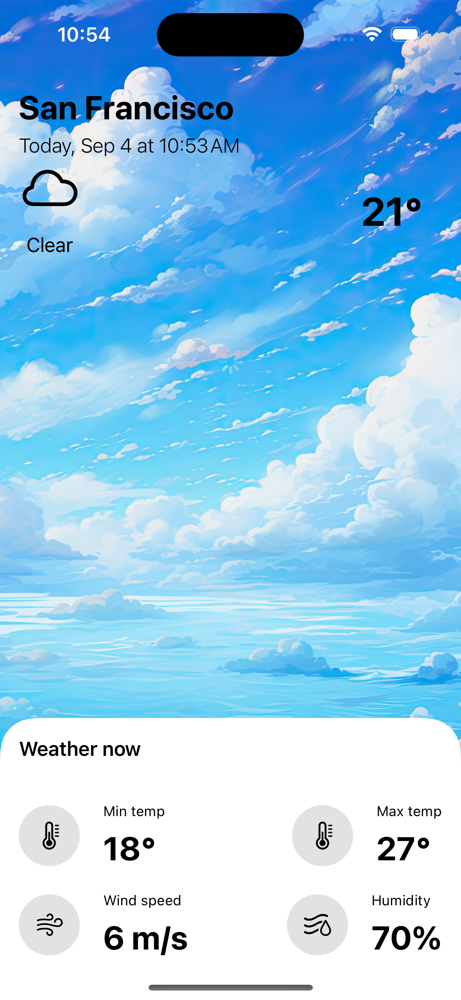

# Weather App  

  

## Overview  

This Weather app, developed using Swift and SwiftUI, provides real-time weather updates and forecasts through a sleek and intuitive user interface. Leveraging modern iOS development practices, the app offers accurate weather information, including current conditions, hourly forecasts, and extended predictions. By integrating Core Location for location-based services and utilizing data fetching from the OpenWeatherMap API, the app delivers a personalized and up-to-date weather experience.  
  
## Features  

- **Core Location:** Utilizes the Core Location framework to access the user's current geographic location, enabling location-based weather updates and enhancing the app's personalization by automatically providing weather information for the user’s location.  
- **Data Fetching:** Manages network requests to retrieve real-time weather data from the OpenWeatherMap API. This feature includes fetching current weather conditions, forecasts, and other relevant meteorological information.  

